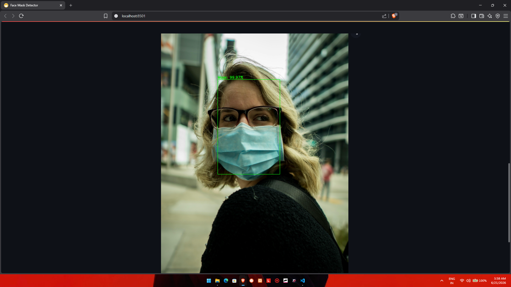

# 😷 Face Mask Detection System

A Deep Learning based Face Mask Detection application built using TensorFlow, OpenCV, MobileNetV2, and Streamlit. The system detects whether a person is wearing a face mask or not from uploaded images and displays the prediction confidence.

## 🚀 Features

- Face Detection using OpenCV DNN
- Face Mask Classification using MobileNetV2
- Streamlit Web Interface
- Upload and Analyze Images
- Real-time Confidence Score
- Clean and User-Friendly UI

## 🛠️ Tech Stack

- Python
- TensorFlow / Keras
- OpenCV
- NumPy
- Streamlit
- MobileNetV2

## 📂 Project Structure

```text
Face-Mask-Detection/
│
├── face_detector/
├── images/
├── Readme_images/
├── mask_detector.model
├── app.py
├── detect_mask_image.py
├── requirements.txt
└── README.md
```

## ⚙️ Installation

Clone the repository:

```bash
git clone https://github.com/Abhisheks006/Face-Mask-Detection.git
cd Face-Mask-Detection
```

Create a virtual environment:

```bash
python -m venv venv
```

Activate the environment:

```bash
venv\Scripts\activate
```

Install dependencies:

```bash
pip install -r requirements.txt
```

Run the application:

```bash
streamlit run app.py
```

## 📸 Screenshots

### Home Page


### Mask Detection



### No Mask Detection


## 🎯 Output

The application classifies faces into:

- ✅ Mask
- ❌ No Mask

with confidence percentage displayed on the image.

## 🔮 Future Improvements

- Webcam-based Detection
- Multi-face Detection
- Cloud Deployment
- Enhanced UI/UX

## 👨‍💻 Author

**Abhishek Sharma**

- MCA Student
- Flutter & Python Developer

GitHub: https://github.com/Abhisheks006
